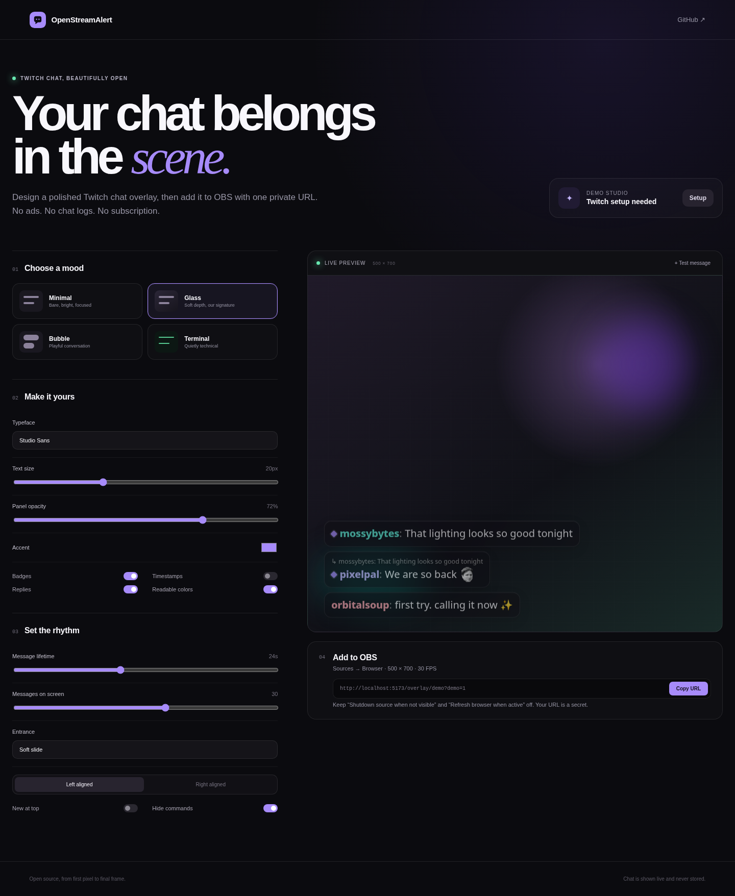
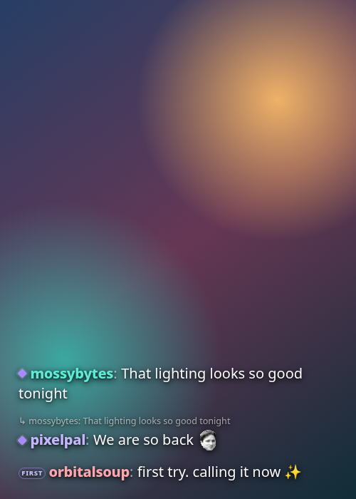
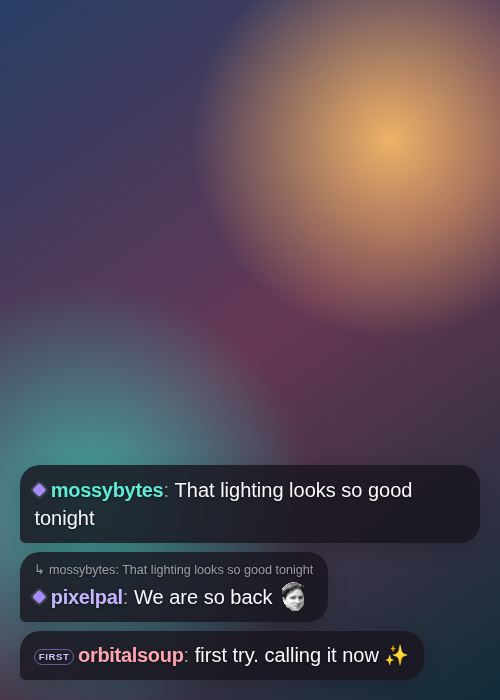
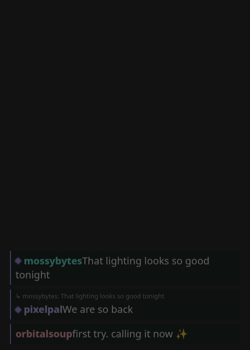
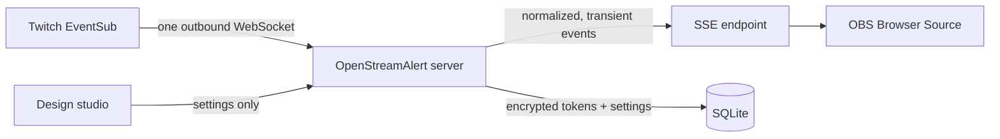

<div align="center">

# OpenStreamAlert

**Beautiful Twitch chat in OBS. Open, private, and yours.**

[](https://github.com/ericflo/openstreamalert/actions/workflows/ci.yml)
[](LICENSE)
[](package.json)

</div>



OpenStreamAlert is a self-hosted Twitch chat overlay made specifically for an
OBS Browser Source. Connect Twitch, choose a look, and copy one private URL. It
stores no chat history, asks for one read-only permission, contains no ads or
analytics, and does not put Twitch credentials in the OBS URL.

> **Which kind of overlay is this?** Chat appears in your broadcast and VOD, so
> viewers can see it. If you need chat floating over a full-screen game only on
> your own monitor, use an always-on-top desktop chat tool instead.

## Why this one?

- **Made to look good immediately.** Minimal, Glass, Bubble, and Terminal are
  complete designs, not starter CSS.
- **One calm setup path.** Connect → style → copy. The studio explains the
  exact OBS settings beside your URL.
- **Private by architecture.** OAuth tokens are encrypted server-side. Chat is
  transformed in memory and never written to disk.
- **Faithful to Twitch.** Native emotes, channel/global badges, replies, actions,
  subscription notices, and moderation deletions are supported from structured
  EventSub data.
- **Resilient in OBS.** SSE reconnects automatically; the Twitch connection
  honors requested migrations, deduplicates deliveries, and backs off after
  network failure.
- **Actually self-hostable.** One Node process, one SQLite file, and an optional
  Docker Compose command. No external database or account system.

## Quick start

You need [Node.js 24+](https://nodejs.org/). To try every design control with
representative demo chat—without Twitch credentials or an `.env` file—run:

```bash
git clone https://github.com/ericflo/openstreamalert.git
cd openstreamalert
npm ci
npm run dev
```

Open `http://localhost:5173`. The studio produces a self-contained demo Browser
Source URL, so you can evaluate the complete design flow before connecting an
account.

### Connect live Twitch chat

In the [Twitch developer console](https://dev.twitch.tv/console/apps), create an
application with this exact OAuth redirect URL:

```text
http://localhost:5173/auth/callback
```

Then create the local configuration:

```bash
cp .env.example .env
openssl rand -base64 32  # paste this value into ENCRYPTION_KEY in .env
```

Populate `TWITCH_CLIENT_ID`, `TWITCH_CLIENT_SECRET`, and `ENCRYPTION_KEY`
together; partial Twitch configuration is rejected to prevent an apparently
configured but unusable instance. Restart `npm run dev`, open the studio, and
press **Connect**.

### Add it to OBS

1. In OBS, choose **Sources → + → Browser**.
2. Paste the private URL shown by OpenStreamAlert and set **Width 500**,
   **Height 700**. Adjust those dimensions to the actual space in your scene.
3. Leave **Shutdown source when not visible** and **Refresh browser source when
   scene becomes active** off. Leave custom FPS off, or use 30 FPS.

The page is explicitly transparent; no custom CSS is required. Treat the
overlay URL like a stream key and rotate it in the studio if it leaks.

## Themes

|                                 Minimal                                  |                                Glass                                 |                                 Bubble                                 |                                  Terminal                                  |
| :----------------------------------------------------------------------: | :------------------------------------------------------------------: | :--------------------------------------------------------------------: | :------------------------------------------------------------------------: |
|  |  |  |  |

Every theme responds to arbitrary OBS dimensions and shares controls for
typeface, scale, background opacity, accent, message lifetime/count, entrance
motion, alignment, direction, badges, timestamps, replies, readable username
colors, notices, commands, and user/phrase blocking. Settings update open OBS
sources live, can be exported as versioned JSON, and honor reduced-motion system
preferences.

## Docker

Fill out `.env`, change `APP_URL` to the public HTTPS origin registered with
Twitch, then run:

```bash
docker compose up -d --build
```

SQLite data lives in the named `openstreamalert-data` volume. Put a TLS reverse
proxy in front of the app for any non-local deployment. See the
[deployment and OBS guide](docs/SETUP.md) before exposing an instance publicly.

To publish only the interactive design demo, leave all three Twitch credential
fields and `ENCRYPTION_KEY` empty. The same production image then serves presets,
preview messages, import/export, and demo Browser Source URLs without OAuth,
accounts, or live chat. Set the public `APP_URL` and use HTTPS exactly as you
would for a connected deployment.

For the zero-server GitHub Pages variant, see the [public demo guide](docs/PUBLIC_DEMO.md).

## How it works



The React studio and overlay ship from the same Express service. The server
uses Twitch's authorization-code flow and requests only `user:read:chat`. OBS
receives an unguessable, revocable overlay key—not an OAuth credential. One
EventSub connection exists while a studio preview or overlay is watching, and
events are normalized into a small safe rendering model before they reach the
browser.

Read [architecture](docs/ARCHITECTURE.md), [privacy and data flow](docs/PRIVACY.md),
and the source-backed [research notes](docs/RESEARCH.md) for the details.

## Documentation

- [Setup, production deployment, and exact OBS settings](docs/SETUP.md)
- [Troubleshooting blank, stale, or incorrectly sized overlays](docs/TROUBLESHOOTING.md)
- [Architecture and trust boundaries](docs/ARCHITECTURE.md)
- [Privacy and data lifecycle](docs/PRIVACY.md)
- [Product scope and principles](docs/PRODUCT.md)
- [Credential-free public demo deployment](docs/PUBLIC_DEMO.md)
- [Credential-free Twitch CLI protocol test](docs/TWITCH_CLI_TESTING.md)
- [Release gates and live acceptance checklist](docs/RELEASING.md)
- [Contributing](CONTRIBUTING.md) and [security policy](SECURITY.md)

## Status and roadmap

OpenStreamAlert is working pre-release software, with no tagged release yet.
Automated tests cover its demo and container paths, but the Twitch connection
requires a real developer application and account. The live OAuth → EventSub →
OBS acceptance checklist must pass before any release is tagged; see
[Releasing](docs/RELEASING.md).

CodeQL and dependency review are prepared and activate when the repository
becomes public; GitHub does not provide their code-scanning backend to this
private repository without GHAS.

The next priorities are packaged desktop/local setup, third-party emote adapters
(7TV, BTTV, FFZ), multiple simultaneous scene profiles, and richer operator
diagnostics.
Follows, subscriptions, raids, and other alerts come after the chat experience
is stable and delightful; multi-platform aggregation and a drag-and-drop canvas
are intentionally out of scope for version one.

## Development

```bash
npm run dev          # server + Vite middleware
npm run check        # browser and server TypeScript
npm run lint
npm test             # unit tests
npm run build
npm run test:e2e     # real Chromium tests (run playwright install first)
npm run test:demo    # static GitHub Pages build and direct overlay route
npm run test:twitch-cli # official local EventSub transport (install Twitch CLI)
```

OpenStreamAlert is available under the [MIT License](LICENSE).
